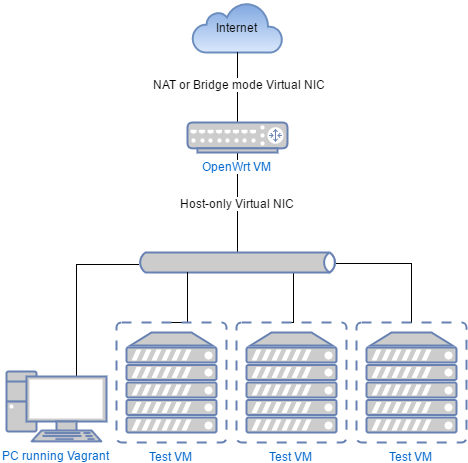

# OpenWrt 15.05 (Chaos Calmer) x86 Vagrant builder

I feel the need, the need for a Vagrant environment in which I can experiment
with various pieces of our SOHO infrastructure without the fear of breaking
physical machines and getting everyone angry in the process:



I followed the build process described on the [OpenWrt wiki page]
(https://wiki.openwrt.org/doc/howto/buildroot.exigence), which you can now also
experience by cloning this repository and bringing the Vagrant machine up.

Watchful eyes will immediately discover that `Vagrantfile` configures two 
provisioners, one for cloning the source repository and initializing a general
build environment for OpenWrt, while the other builds stuff and produces
a disk image that can be converted to a box. To use the former provisioner
only, run the `vagrant up --provision-with devenv` command when starting. 
Should you continue to the building phase, you might want to grab a nice book
and a cup of coffee; the build runs for about an hour and a half on my machine.

When finished, the second provisioner copies the resulting disk image, 
`openwrt-x86-kvm_guest-combined-ext4.vdi` to the directory `box`, and shuts 
down the builder VM immediately after that. Run `create_box.sh` to create a
base VM using the image and package it for distribution.

The resulting file is called `openwrt.box`, and you can add it to Vagrant's 
local list of boxes with the command:

```
$ vagrant box add openwrt.box --name pppq/openwrt --force
==> box: Box file was not detected as metadata. Adding it directly...
==> box: Adding box 'pppq/openwrt' (v0) for provider:
    box: Unpacking necessary files from: file://Development/openwrt/box/openwrt.box
    box:
==> box: Successfully added box 'pppq/openwrt' (v0) for 'virtualbox'!
```

Apart from building the disk image locally, this project is heavily inspired
by [Praneeth's OpenWrt box builder](https://github.com/lifeeth/openwrt-in-vagrant).

The following changes were made to make life as a Vagrant VM easier:

- Root password is set to `vagrant`; A user with ID `vagrant` also exists, its
password is also set to `vagrant` and accepts the default insecure SSH key,
which should be replaced on first startup by Vagrant automatically.
- The first interface is in NAT mode by default, allowing `vagrant ssh` to work
as expected. Guest port 443 is forwarded to host port 8443, while Vagrant 
manages forwarding for SSH port 22.
- The first network interface is assigned to the WAN role; SSH connections and 
access to LuCI is enabled in the firewall configuration. (Note that depending on
your use case, these settings might make your VM less secure.)
- To connect other VMs to the LAN side, add a host-only interface in the second
slot with an IP address of 192.168.99.2, netmask 255.255.255.0 and no default 
gateway set. The VM will assign the static IP address of 192.168.99.1 for its 
LAN-facing bridge.
- OpenSSH is installed instead of the default dropbear.
- The `shutdown` command is enabled via a small script that delegates to 
`poweroff`; ACPI power button handling also works.
- Folder syncing is disabled.
